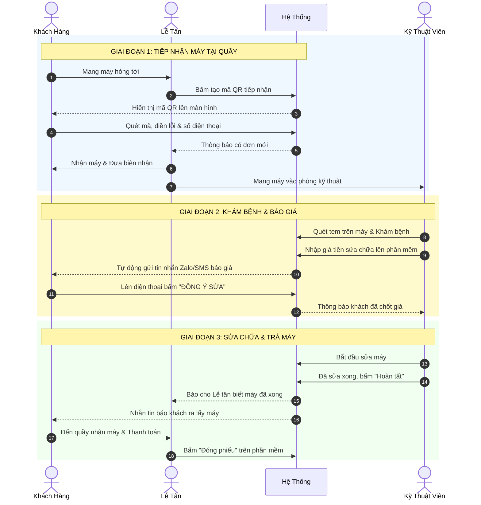

# BẢN KẾ HOẠCH NÂNG CẤP & TỐI ƯU HÓA BACKEND HỆ THỐNG CSKH BẰNG QR
*(Dành cho Trung tâm Sửa chữa Máy tính & Điện thoại chuyên nghiệp)*

Sau quá trình nghiên cứu các hệ thống quản lý sửa chữa chuyên nghiệp hiện nay (như hệ thống của Thế Giới Di Động, FPT Shop, Điện Thoại Vui) và các giải pháp CRM kết hợp mã QR, tôi xin đề xuất một kiến trúc và luồng làm việc Backend hoàn chỉnh, hiện đại và "xịn" nhất cho dự án của bạn.

---

## 1. PHÂN TÍCH NHỮNG ĐIỂM YẾU TRONG LUỒNG LÀM VIỆC CŨ
- **Chỉ dùng QR để "tiếp nhận ban đầu":** Sau khi khách điền form tại quầy, vòng đời của mã QR kết thúc. Điều này lãng phí tiềm năng của QR.
- **Thiếu tính năng Tra cứu Tiến độ & Bảo hành Điện tử:** Khách hàng đem máy về nhà không biết máy đã sửa tới đâu, phải gọi điện hỏi, gây áp lực cho bộ phận CSKH.
- **Giao tiếp 1 chiều:** Lễ tân/KTV cập nhật trạng thái nhưng khách không nhận được thông báo ngay lập tức.
- **Thiếu log lịch sử (Audit Trail):** Không biết KTV nào đã đổi trạng thái vé lúc mấy giờ, không có bằng chứng (hình ảnh máy trước/sau khi sửa).

---

## 2. PHÂN QUYỀN & LUỒNG NGHIỆP VỤ CƠ BẢN (ROLES & WORKFLOW)

Hệ thống xoay quanh 4 đối tượng chính với các chức năng hoàn toàn biệt lập để đảm bảo bảo mật và đúng luồng nghiệp vụ:

### 2.1. Quản lý / Admin (Người nắm quyền cao nhất)
- **Quản trị Nhân sự:** Tạo tài khoản, cấp quyền cho Lễ tân và Kỹ thuật viên (KTV), khóa tài khoản khi nhân viên nghỉ việc.
- **Quản lý Kho:** Thêm/sửa/xóa thông tin linh kiện, cấu hình cảnh báo khi kho sắp hết.
- **Xem Thống kê (Dashboard):** Xem biểu đồ doanh thu, hiệu suất của từng KTV, tỷ lệ khách quay lại, và các đánh giá (Rating) từ khách hàng.

### 2.2. Lễ tân (Receptionist) - Điểm chạm đầu tiên & cuối cùng
- **Tiếp nhận:** Mở phiên tạo QR (Intake QR) hoặc tự tay nhập thông tin khách hàng nếu khách không rành công nghệ. In biên nhận/tem dán có mã Tracking QR.
- **Giao tiếp khách hàng:** Giải đáp thắc mắc nếu khách gọi điện tới cửa hàng.
- **Bàn giao & Thu tiền:** Khi KTV báo đã sửa xong, Lễ tân nhận máy, gọi khách đến lấy (hoặc hệ thống tự nhắn tin), thu tiền, in hóa đơn và bấm **Đóng phiếu (CLOSED)**.

### 2.3. Kỹ thuật viên (Technician) - Người thực thi
- **Tiếp nhận máy từ Lễ tân:** Dùng thiết bị quét mã tem trên máy để mở nhanh thông tin Phiếu trên màn hình (Không cần gõ mã thủ công).
- **Chuẩn đoán & Báo giá:** Kiểm tra lỗi thực tế, chọn linh kiện cần thay từ Kho, nhập giá tiền -> Bấm Gửi báo giá (Hệ thống tự động thông báo cho khách).
- **Thực hiện sửa chữa:** Chuyển trạng thái phiếu sang `IN_PROGRESS` (Đang sửa). Chụp ảnh máy trong quá trình sửa nếu cần.
- **Hoàn tất:** Bấm nút **"Đã sửa xong"** -> Hệ thống tự trừ kho linh kiện và thông báo cho Lễ tân ra nhận máy.

### 2.4. Khách hàng (Customer) - Trải nghiệm tự động hóa
- **Tự phục vụ:** Quét QR để tự điền form tình trạng máy lúc mới tới cửa hàng.
- **Theo dõi từ xa:** Tra cứu tiến độ sửa chữa bằng QR hoặc SĐT trên Web bất cứ lúc nào.
- **Quyết định (Tương tác):** Nhận thông báo báo giá qua Zalo/SMS -> Lên Web bấm Đồng ý hoặc Hủy sửa chữa.
- **Phản hồi:** Đánh giá chất lượng dịch vụ (1-5 sao) sau khi đã mang máy về nhà.

### 2.5 Sơ đồ Luồng Tương Tác (Sequence Diagram)

Dưới đây là sơ đồ trực quan hóa toàn bộ quá trình từ khi khách hàng bước vào cửa hàng cho đến khi nhận lại máy ra về:



---

## 3. THIẾT KẾ LUỒNG LÀM VIỆC MỚI BẰNG QR (ADVANCED WORKFLOW)

Hệ thống sẽ sử dụng **2 LOẠI MÃ QR KHÁC NHAU** để phục vụ tối đa vòng đời khách hàng:

### Luồng 1: QR TIẾP NHẬN (Intake QR) - Tại quầy
1. Lễ tân hiển thị mã **Intake QR** (Có thể in cố định đặt trên bàn hoặc hiện trên màn hình, link dạng `domain.com/intake?branch=1`).
2. Khách quét mã, điền SĐT. Hệ thống gửi OTP xác thực để tránh rác (Spam).
3. Khách điền tình trạng máy, chụp hình thực trạng máy (tránh cãi vã về trầy xước sau này).
4. Nhấn Gửi -> Lễ tân nhận thông báo **Real-time (Websocket)** -> Lễ tân in ra 1 tờ Biên nhận có chứa **Mã QR Tra cứu**.

### Luồng 2: TRA CỨU TIẾN ĐỘ & BẢO HÀNH (Qua QR hoặc Tra cứu bằng SĐT trên Web) - Sau khi nhận máy
1. **Khách hàng có 2 cách để tra cứu:**
   - **Cách 1 (Quét QR):** Quét mã Tracking QR trên biên nhận/tem dán máy (`domain.com/track/:ticketCode`).
   - **Cách 2 (Tra cứu Web bằng SĐT):** Truy cập thẳng vào website của cửa hàng, nhập **Số điện thoại** (đã đăng ký lúc tiếp nhận) và mã OTP (nhận qua SMS/Zalo) để xem danh sách toàn bộ các máy đang sửa hoặc đã từng sửa.
2. **Khách hàng sẽ xem và tương tác được các mục sau:**
   - **Timeline tiến độ:** Chờ khám -> Đang sửa -> Chờ linh kiện -> Đã xong (Cập nhật thời gian thực).
   - **Báo giá & Xác nhận (Tương tác 2 chiều):** KTV cập nhật nguyên nhân & giá linh kiện -> Hệ thống tự động Push thông báo về **Zalo ZNS / SMS** cho khách -> Khách lên Web tra cứu bằng SĐT hoặc bấm vào link trong tin nhắn -> Nhấn **"Đồng ý sửa"** hoặc **"Từ chối (Hủy)"**.
   - **Bảo hành điện tử:** Tra cứu thời hạn bảo hành còn lại của các thiết bị, linh kiện đã thay.

---

## 4. ĐỀ XUẤT CÁC TÍNH NĂNG MỞ RỘNG (XỊN XÒ) CHO BACKEND

Để hệ thống trở nên Đẳng Cấp và Khác Biệt so với các đồ án thông thường, tôi đề xuất thêm các tính năng sau:

1. **Hệ thống Tích điểm & Hạng thành viên (Loyalty Program):**
   - Mỗi lần sửa chữa thành công, Backend tự động cộng điểm thưởng vào SĐT khách hàng (Phân hạng Đồng, Bạc, Vàng). Tự động giảm giá % ở các lần sửa tiếp theo hoặc mua phụ kiện.
2. **Quản lý Kho linh kiện (Inventory & Alert):**
   - Khi KTV bấm xác nhận thay "Màn hình Dell XPS", Backend tự động trừ `1` trong kho linh kiện. Nếu kho sắp hết (< 5 cái), hệ thống tự động bắn thông báo qua Telegram/Zalo cho người Quản lý đi nhập hàng.
3. **Thống kê Doanh thu & KPIs Nhân viên (Dashboard API):**
   - API gom nhóm dữ liệu (Aggregation): Tính doanh thu theo ngày/tháng, top KTV sửa nhiều máy nhất, hoặc biểu đồ các lỗi phổ biến nhất trong tháng để dự đoán nhập linh kiện.
4. **Đánh giá dịch vụ (Rating & Review):**
   - Sau khi Lễ tân bấm "Đóng phiếu" (Khách đã lấy máy), 1 ngày sau Backend dùng Cronjob tự động gửi tin nhắn Zalo/SMS xin khách hàng đánh giá dịch vụ (1 - 5 sao). Đánh giá dưới 3 sao tự động thông báo cho Quản lý.

---

## 5. THIẾT KẾ KIẾN TRÚC BACKEND (TECH STACK TỐI ƯU)

Để đáp ứng luồng trên một cách mượt mà và chịu tải tốt, cấu trúc công nghệ nên nâng cấp như sau:

- **Framework:** `Express.js` (hoặc chuyển sang `NestJS` nếu muốn kiến trúc enterprise chuẩn chỉnh hơn).
- **Database:** `PostgreSQL` (Vẫn dùng Supabase, rất tốt) sử dụng tiếng việt
- **Caching & Rate Limit:** `Redis` (Lưu OTP, lưu phiên đăng nhập, giới hạn số lần request API chống phá hoại).
- **Real-time:** `Socket.io` (Bắn thông báo tức thì giữa Lễ tân <-> KTV <-> Khách hàng).
- **Lưu trữ ảnh (Storage):** `Supabase Storage` hoặc `Cloudinary` (Để lưu ảnh máy hỏng trước và sau khi sửa).
- **Notification Integration:** Tích hợp API của `Zalo ZNS` hoặc `Twilio SMS` để gửi tin nhắn tự động khi sửa xong.

---

## 6. CẤU TRÚC DATABASE (THIẾT KẾ DẠNG TIẾNG VIỆT)

Sử dụng Prisma Schema, chúng ta sẽ có các bảng (Tables) thiết yếu sau (tên bảng trong Database vẫn là tiếng Anh để chuẩn quốc tế, nhưng nội dung được giải thích hoàn toàn bằng tiếng Việt để bạn dễ hiểu):

1. **Bảng Users (Tài khoản nhân viên nội bộ):**
   - Chứa thông tin: Mã nhân viên (ID), Họ Tên, Phân quyền (Quản lý, Lễ tân, Kỹ thuật viên), Mật khẩu, Trạng thái (Đang làm/Đã nghỉ).
2. **Bảng Customers (Thông tin Khách hàng):**
   - Chứa thông tin: Mã khách hàng (ID), Số điện thoại, Họ Tên, ZaloID (dùng để gửi tin nhắn Zalo), Điểm tích lũy (Dùng cho hạng thành viên).
3. **Bảng Devices (Thông tin Thiết bị của khách):**
   - Chứa thông tin: Mã thiết bị (ID), Thuộc về Khách hàng nào (CustomerID), Tên máy (VD: iPhone 15 Pro), Số Serial/IMEI, Ghi chú tình trạng máy.
4. **Bảng Tickets (Phiếu sửa chữa / Đơn hàng):**
   - Chứa thông tin: Mã phiếu (ID), Mã Code tra cứu (VD: RP-240901).
   - Trạng thái phiếu: `CHỜ_KHÁM`, `ĐANG_CHUẨN_ĐOÁN`, `CHỜ_KHÁCH_CHỐT_GIÁ`, `ĐANG_SỬA`, `CHỜ_LINH_KIỆN`, `ĐÃ_SỬA_XONG`, `ĐÃ_GIAO_KHÁCH_VÀ_THU_TIỀN`, `HỦY`.
   - Tổng tiền sửa chữa, Ngày hết hạn bảo hành.
5. **Bảng TicketHistories (Nhật ký sửa chữa - Rất Quan Trọng):**
   - Chứa thông tin: Lưu lại toàn bộ lịch sử (Ai làm, Làm lúc mấy giờ, Đổi từ trạng thái cũ sang trạng thái mới, Ghi chú báo giá). 
   - *Mục đích:* Khi khách quét QR tra cứu trên điện thoại, hệ thống sẽ rút dữ liệu từ bảng này ra để vẽ thành một cái Timeline (Dòng thời gian) cực kỳ chuyên nghiệp.
6. **Bảng TicketImages (Hình ảnh đính kèm phiếu):**
   - Chứa thông tin: Link hình ảnh (Hình ảnh khách tự chụp lúc gửi máy, và hình ảnh KTV chụp lại lúc sửa xong để làm bằng chứng).

---

## 7. DANH SÁCH CÁC NHÓM API CẦN XÂY DỰNG

### Nhóm 1: Auth & User Management
- `POST /api/auth/login` (Cấp JWT Access Token & Refresh Token)
- `GET /api/users/me` (Lấy thông tin nhân viên đang đăng nhập)

### Nhóm 2: Khách hàng tự phục vụ (Self-service - Không cần JWT, chặn bằng Rate Limit)
- `POST /api/public/intake/send-otp` (Gửi OTP qua SĐT)
- `POST /api/public/intake/submit` (Nộp phiếu khám bệnh kèm ảnh thực trạng)
- `GET /api/public/track/:ticketCode` (Lấy thông tin tiến độ, lịch sử sửa, hạn bảo hành - Trả về che giấu SĐT để bảo mật, VD: `090****123`).
- `POST /api/public/track/:ticketCode/approve-quote` (Khách hàng bấm đồng ý báo giá).

### Nhóm 3: Nhân viên (Lễ tân & KTV)
- `GET /api/tickets` (Lấy danh sách phiếu, có filter theo Trạng thái)
- `PATCH /api/tickets/:id/status` (Đổi trạng thái phiếu)
- `POST /api/tickets/:id/quote` (KTV cập nhật báo giá)
- `POST /api/tickets/:id/images` (KTV upload ảnh sau khi sửa xong)

---

## 8. LƯU Ý VỀ BẢO MẬT & TRẢI NGHIỆM

1. **Bảo mật mã QR Tracking:** Mã QR in trên biên nhận mang tính cá nhân. Khi khách quét mã QR, API trả về dữ liệu nên **che bớt (masking)** các thông tin nhạy cảm (Tên: Nguyễn Văn A -> Ng*** V** A, SĐT: 0912***345). Chỉ khi khách nhập đúng 4 số cuối SĐT để xác nhận thì mới hiện full thông tin.
2. **Transaction DB (Rollback):** Khi tạo 1 Ticket mới, phải đồng thời tạo Customer (nếu chưa có), tạo Device, tạo Ticket, và tạo TicketHistory. Quá trình này phải nằm trong 1 `DB Transaction`. Nếu 1 bước lỗi, toàn bộ phải Rollback, không để sinh ra dữ liệu rác.
3. **Chuẩn hóa Error Response:** Backend luôn trả về cấu trúc thống nhất:
```json
{
  "success": false,
  "errorCode": "TICKET_NOT_FOUND",
  "message": "Không tìm thấy mã phiếu này. Vui lòng kiểm tra lại!",
  "data": null
}
```

---

## TỔNG KẾT
Kế hoạch này biến hệ thống từ một tool "tạo form đơn giản" thành một **Nền tảng CRM Sửa chữa toàn diện**, số hóa hoàn toàn trải nghiệm khách hàng từ lúc bước vào cửa hàng cho đến khi bảo hành thiết bị. 

*Bạn có thể xem xét áp dụng Prisma ORM và Socket.io ngay từ bây giờ để tạo nền móng vững chắc nhất.*
